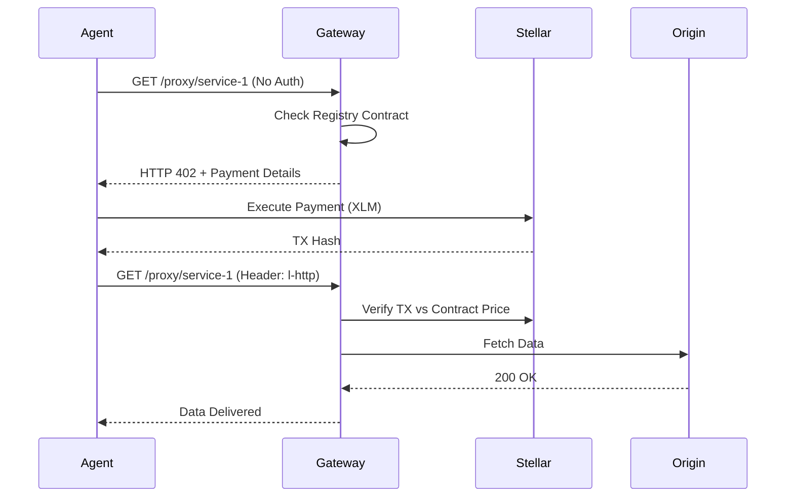

# Heekowave


> The Autonomous Settlement Gateway & API Registry for the Agentic Economy.

## Problem Statement

AI Agents are the new consumers of the internet, yet they face a critical infrastructure bottleneck: **The Credit Card Wall**.

- Agents cannot autonomously subscribe to SaaS platforms.
- Human-centric payment flows (KYC, credit cards, monthly billing) are incompatible with sub-second agentic logic.
- APIs lack a native "Pay-Per-Request" settlement layer that operates without human intervention.

## Solution

Heekowave solves these challenges by modernizing the `402 Payment Required` HTTP status using the **Stellar blockchain**.

1. **Decentralized Discovery**
   - A Soroban-based on-chain registry where service providers define endpoints and micro-prices.
2. **x402 Enforcement Gateway**
   - A specialized proxy that intercepts requests and challenges agents with a cryptographic payment requirement.
3. **Autonomous Settlement**
   - Agents sign verifiable transaction receipts (L-HTTP) to clear the paywall in milliseconds.

## The Agentic Settlement Logic

Heekowave leverages the **x402 Protocol** to allow agents to pay for data programmatically.

### 1. The Challenge Flow

When an agent requests a protected API:

```plaintext
HTTP 402 Payment Required
X-Stellar-Destination: G... (Provider Wallet)
X-Stellar-Amount: 1.5 (XLM)
X-Stellar-Network: Testnet
```

### 2. Autonomous Signing

The agent detects the 402, executes a Stellar transaction, and generates an `L-HTTP` receipt:

```javascript
const receipt = {
  hash: "TX_HASH",
  signer: "AGENT_PUBLIC_KEY",
  timestamp: Date.now()
};

// Re-request with receipt
headers: {
  "l-http": btoa(JSON.stringify(receipt))
}
```

### 3. Gateway Verification



## Architecture

```plaintext
heekowave/
├── contracts/        # Soroban Smart Contracts (Rust)
│   └── src/lib.rs    # On-chain Service Registry
├── gateway/          # NestJS x402 Interceptor Proxy
│   ├── src/proxy/    # x402.guard.ts & Routing logic
│   └── prisma/       # Indexed service cache
└── frontend/         # Next.js 15 Marketplace Dashboard
    ├── src/store/    # Zustand Global State Management
    └── src/app/      # Registry & Agent Sandbox UI
```

## Core Components

### Registry Contract (Soroban)

The single source of truth for pricing. It ensures providers can update endpoints without breaking the gateway synchronization.

### x402 Gateway (NestJS)

A high-performance proxy that syndicates on-chain metadata into a local cache for sub-second verification latency.

### Agent Sandbox

An integrated environment to test the full "Payment-for-Data" loop using a temporary autonomous wallet.

## Getting Started

### 1. Prerequisites

- **Docker** (for Postgres)
- **Node.js 20+** & **pnpm**
- **Freighter Wallet Extension** (for registration)

### 2. Setup Environment

Clone and install dependencies:

```bash
git clone https://github.com/velikanghost/heekowave.git
cd heekowave
pnpm install
```

Configure the Services:

```bash
# Gateway configuration
cd gateway && cp .env.example .env

# Frontend configuration
cd ../frontend && cp .env.example .env
```

### 3. Build & Deploy Contracts

If you wish to deploy your own instance of the registry:

```bash
cd contracts
stellar contract build --optimize
stellar contract deploy \
  --wasm target/wasm32v1-none/release/heekowave.wasm \
  --source-account <YOUR_ACCOUNT> \
  --network testnet
```

### 4. Boot the Ecosystem

Run everything concurrently (Frontend, Gateway, Database):

```bash
pnpm dev
```

## How to Test the Product

1. **Connect Wallet**: Visit `http://localhost:3000` and connect Freighter.
2. **Register a Service**: Click **"Deploy a Service"**. Define a name, Origin URL (e.g., a mock API), and XLM price per request.
3. **Verify On-Chain**: The registration broadcasts to Soroban. Once confirmed, it appears in the **Marketplace**.
4. **Agent Simulation**:
   - Go to the **Sandbox** page.
   - Select your newly registered service.
   - Click **"Boot Agent Toolbox"**.
   - Click **"Execute Agentic Call"**.
5. **Watch the Magic**:
   - The Sandbox detects the 402 challenge.
   - It autonomously executes a Stellar payment to the provider.
   - It signs the receipt and successfully fetches the data from the origin server!

---

<p align="center">Built with ❤️ for the Stellar Agentic Hackathon</p>
